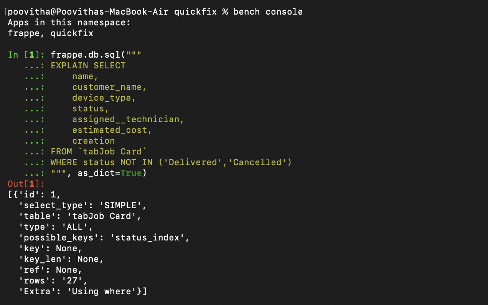

ANSWERS:

site_config.json : This is for one particuler site which handles the site's db name , password and type.It reflects the changes for particular site.

common_site_config.json : This is for whole bench's sites which ensures to have the common configurations for whole bench,it reflects to all the sites in the bench.

if you accidentally put a secret in common_site_config.json, It leads to loss of secret's integrity which can be access by all the sites. When a developer shared a secret message unintentionally in common_site_config.json , in production site also it will reveal.

4 processes bench start launches:
~ web
~ worker
~ scheduler
~ socketio

1.Web - It is client side which handle the requests from the client and it responses back to the client.
2.Worker - Helps to executes background jobs like emails, reports, and long tasks without slowing the user or getting timeout error.
3.Schedular - Automatically runs timed tasks by cron, such as backups, reminders and emails.
4.Socketio - Maintains a real time connection between client and server to send instant updates like notifications, chat messages, and progress status.

If a worker is crashed during execution, the Background job moves to the queue and can be continue when the worker restarts.

When a browser hits /api/method/quickfix.api.get_job_summary, frappe knows that it need to execute the whitelist method by /api/method/ and quickfix.api.get_job_summary is the path to the file with function name so it directly access the function. When all user want to access the function @frappe.whitelist(allow_guest=True) is used.

How does Frappe find it?
    Frappe finds the request from the browser by , When client request to access http://quickfix-dev.localhost:8011/api/method/quickfix/api.add send to the app.py and handler.py checks /api/method/ it leads to continue with the path to location by execute_cmd() in handler.py and to execute the function get_attr() in init.py is used, which Execute the function and return the result in JSON format.

When a browser hits /api/resource/Job Card/JC-2024-0001 - what happens differently compared to /api/method/ ?
    /api/resource/ is a RestAPI,it don't need any custom funtion to execute which can be called by just doctype name. In Body, What input should send can be written by client if needed and it will pass to that doctype.
    /api/resource/Job Card/JC-2024-0001 - This will return the data for authorised user from the JC-2024-0001 document record.

    /api/method/ is the CustomAPI which is called by the function detailed location path,when request send which Execute the function and return the result in JSON format.

When a browser hits /track-job - which file/function handles it and why?
    /track-job is called by customAPI , when the request hit frapppe it send to app.py and handler.py checks /api/method/ it leads to continue with the path to location by execute_cmd() in handler.py and to execute the /track-job function get_attr() in init.py is used, return the result in JSON format.

Where does this value come from ?
     Cross-site request forgery-Token basically generated when a user login in with a password first time, the token will generate randomly and stored in session. It will generate randomly and every time when a user try to access the page by Put,Post,Get and it verify by the token.

what would happen if you omitted it?
     When CSRF Token is omitted, Frappe wont allow the request because Security breaches will occur when other attacker tries to enter as user it will allow easily and data's will be at risk.

In bench console, run: import frappe; frappe.session.data and it returns a empty set but when we frappe.session is enter it will return the user, data and session id. When frappe.session.user is entered it will return the user.

With developer_mode: 1 - trigger a Python exception in one of your whitelisted methods. What does the browser receive?
     I have initialize a = 10,b = 0,and c = a/b. When i try to call the function it throws an entire traceback 500: Uncaught Exception
     File "apps/quickfix/quickfix/api.py", line 8, in add
      c = a/b
        ~^~
    ZeroDivisionError: division by zero

Set developer_mode: 0 - repeat. What does the browser receive now? Why is this important for production?
    Even i tried in development_mode: 0, I got the same output by full traceback as i got from developer_mode : 1. Then i researched about that then i got to know that when developer_mode is off , Internal server error only show up unlike traceback error.
    I studied that in local development,the error output may appear the same even when developer mode is off for debugging purpose.

Where do production errors go if they are hidden from the browser?
    The full error details are stored in the bench log files such as frappe.log in logs folder. I explored in the VS code about it.

In a whitelisted method, call frappe.get_doc("Job Card", name) WITHOUT ignore_permissions. Then log in as a QF Technician user who is NOT assigned to that job. What error is raised and at what layer does Frappe stop the request?
    As i use v16, get_doc is not checking permission by default,when we force it to check_permission it throws an error.

The following line will check when i give check permission
https://github.com/akhilnarang/frappe/blob/c290cffc2711a89848f8d132c32442ab3fd18a5e/frappe/model/document.py#L156

Run: frappe.db.sql("SHOW TABLES LIKE '%Job%'") and list what you see,
    In [1]: frappe.db.sql("SHOW TABLES LIKE '%Job%'")
    Out[1]: (('tabJob Card',), ('tabScheduled Job Log',), ('tabScheduled Job Type',))

    it list the tables which has job in their table name. tab is the short form of table which is default prefix with that every table name will store in the database which help to avoid conflict in duplication of table name.

Run: frappe.db.sql("DESCRIBE `tabJob Card`", as_dict=True) and list 5 column names you recognise from your DocType fields.
    It shows the database columns (fields) created from the Job Card DocType.
    {'Field': 'customer_name',
    'Type': 'varchar(140)',
    'Null': 'YES',
    'Key': '',
    'Default': None,
    'Extra': ''}
    {'Field': 'assigned__technician',
    'Type': 'varchar(140)',
    'Null': 'YES',
    'Key': '',
    'Default': None,
    'Extra': ''},
    {'Field': 'customer_phone',
    'Type': 'varchar(140)',
    'Null': 'YES',
    'Key': '',
    'Default': None,
    'Extra': ''},
    {'Field': 'customer_email',
    'Type': 'varchar(140)',
    'Null': 'YES',
    'Key': '',
    'Default': None,
    'Extra': ''},
    {'Field': 'device_type',
    'Type': 'varchar(140)',
    'Null': 'YES',
    'Key': '',
    'Default': None,
    'Extra': ''},

What are the three numeric values of docstatus and what state does each represent?
    Draft - docstatus 0
    Submitted - docstatus 1
    Cancelled - docstatus 2

Can you call doc.save() on a submitted document? What about doc.submit() on a cancelled one?
when doc.save()
In [1]: doc = frappe.get_doc("Job Card","JC-2026-00001")

In [2]: doc.save()
Out[2]: <JobCard: doctype=Job Card JC-2026-00001 docstatus=1>

doc.save() validate the function in the doctype but if any fields are in the allow_on_submit condition it will save the changes if there is any changes.

when doc.submit() on cancelled one:
 elif to_docstatus == DocStatus.CANCELLED:
-> 1083 	raise frappe.ValidationError(_("Cannot edit cancelled document"))
 because in cancelled doctype , user cant able to edit or submit.

Why would you see a "Document has been modified after you have opened it" error and how does Frappe prevent concurrent overwrites?
    This error occur when a changes save in db and didnt the client server is reload properly , when again user tries to save the document it will throw the error. To overcome this after save the site can be reload function.

B2 :Part - E
The corrected version
    def validate(self):
        self.total = sum(r.amount for r in self.items)

    def on_submit(self):
        other = frappe.get_doc("Spare Part", self.part)
        other.stock_qty -= self.qty
        other.save()

    In snippet , they mention save() in validate it is wrong because validate is called when a document does any action. so save don't need when function is validate.

    They update the stock qty after a transaction , when the function is in validate means it will call every single answer and it will show the wrong result
When you append a row to Job Card.parts_used and save, what 4 columns does Frappe automatically set on the child table row?

What is the DB table name for the Part Usage Entry DocType?
    tabPart Usage Entry

If you delete row at idx=2 and re-save, what happens to idx values of remaining rows?
    It will automatically renumbers the remaining rows to main a sequence order.

Rename one of your test Technician records using the Rename Document feature. Then check: does the assigned_technician field on linked Job Cards automatically update? Why or why not? What does "track changes" mean in this context?
    When i try to rename the document name , it will trigger the rename.py file and frappe.db.set_value("Custom DocPerm", {"parent": old}, "parent", new, update_modified=False) will excute. The linked document also change , it will set value in db. Due to update_modified == False will hide the changes to track.

Explain unique constraints: what is the difference between setting a field as "unique" in the DocType vs doing a frappe.db.exists() check in validate()?
    Unique constraints doesn't allow duplications in fields. if a field is marked as unique it wont allow user to enter duplicate data and prevent in db level but in frappe.db.exists() will check the duplicate when the user do any actions like save or update.comparing to unique setting exists() is slightly cannot prevent in validation.

Call self.save() inside on_update and see to the issues of it and explain them. Correct the pattern and explain it.
    Calling save() inside on_update() creates an infinite loop because there is a loop like on_update -> save() -> update -> on_update .
    if we want to update a field data , just on_update -> what want to update (self.status = "Paid"), frappe automatically saves the field data.

In a utility function, call frappe.rename_doc("Technician", old_name, new_name,merge=False) and show how linked fields(assigned_technician on Job Cards) are updated automatically?
    frappe.rename_doc() renames the document name from old name to new name and update all the linked fields also updated automatically and merge = false is for , if any same name document is exist the current document will avoid to merge with existing.
In bench console: call frappe.get_doc_permissions(doc) on a Job Card while logged in as different users. Document what the return dict looks like? Correct function is frappe.permission.get_doc_permission()
    In [4]: doc = frappe.get_doc("Job Card", "JC-2026-00002")

    In [5]: doc
    Out[5]: <JobCard: doctype=Job Card JC-2026-00002>

    In [6]: frappe.get_doc_permissions(doc)
    ---------------------------------------------------------------------------
    AttributeError                            Traceback (most recent call last)
    Cell In[6], line 1
    ----> 1 frappe.get_doc_permissions(doc)

    AttributeError: module 'frappe' has no attribute 'get_doc_permissions'
    In [9]: frappe.set_user("technician@gmail.com")
    ...: frappe.permissions.get_doc_permissions(doc)
    Out[9]: 
    {'if_owner': {},
    'has_if_owner_enabled': False,
    'select': 0,
    'read': 0,
    'write': 0,
    'create': 0,
    'delete': 0,
    'submit': 0,
    'cancel': 0,
    'amend': 0,
    'print': 0,
    'email': 0,
    'report': 0,
    'import': 0,
    'export': 0,
    'share': 0}

What is the issues in using frappe.get_all in a whitelisted method that is exposed to guests or low-privilege users. Explain it in the context of permission_query_conditions
     frappe.get_all() bypasses permission_query_conditions and record-level checks, so using it in guest or low-privilege APIs can cause serious data leakage.

Difference between app_include_js and web_include_js

    app_include_js: Loads global JS for the Desk interface used by logged-in users. Used to enhance backend and workflows.
    web_include_js: Loads JavaScript for website and portal pages. Used to enhance public-facing UI and interactions.

doctype_js : Override the JS form validation for specific doctype.
doctype_list_js : It can override specific list of doctype which need to override the form validation.
doctype_tree_js : Used for DocTypes with hierarchical structure like parent and child . Job card is a transaction doctype which has no hierarchical structure.

bench build : if the UI is broken, it is used to compiles and bundles the app’s JS into the assets folder. Ensures updated frontend files are prepared for use.

Cache Busting : Browsers cache old JS/CSS, so changes may not appear immediately,and forces the browser to load the latest version.

Explain the difference between override_whitelisted_methods (hook-based, reversible, explicit) vs monkey patching(import-time, brittle, invisible). When would you use each?
    
    override_whitelisted_methods : it is a hook in hooks.py used to replace a whitelisted function with a custom implementation without modifying core files. It is easy to trace and user friendly.

    monkey patching : Monkey patching replaces or modifies functions at runtime by directly changing imported code. It is hard to trace and it is not recommended.

    When monkey patch is used , there is no hook exist to work on a scenario monkey patch will be approached . It is only for development purpose , shouldn't used in production site.

What happens if TWO apps both register override_whitelisted_methods for the same method? Write the answer.
    If two apps override the same whitelisted method, the override from the app loaded last is used, while others are ignored, which may cause error.

Explain about the Signature mismatch and not having exactly the same arguments as the original and in what case would you get a TypeError.
    A signature mismatch occurs when the override method does not match the original function’s parameters.Since Frappe passes the original arguments, Python raises a TypeError if required parameters are missing or differ from original.

Explain fieldname collision risk: what happens if your Custom Field has the same fieldname as a field added by a future Frappe update?
    Fieldname collision happens when two fields try to use the same fieldname in db column in a DocType.
    If a Custom Field uses a fieldname later added by a Frappe update, it causes duplicate column conflicts, migration failures, or type mismatches that can break the app.

Explain patching order: if Patch 1 creates a Custom Field and Patch 2 reads it, why must they be separate entries in patches.txt and never merged?
    A patch is a one time update script that safely changes the database during the bench migrate. If Patch 2 depends on a field created in Patch 1, they must be separate and ordered in patches.txt or else Patch 2 may run first and fail with column not found errors.
Register TWO validate handlers on Job Card - one in your main controller and one in doc_events. In README_internals.md: in what order do they run? What happens if both raise a frappe.ValidationError?
    Controller method runs first, followed by doc_events hooks. If both raise frappe.ValidationError, execution stops at the first error and hooks do not run.

Demonstrate: what happens when you register "*" AND a specific DocType handler for the same event? Do both run?
    If both "*" and a specific DocType handler are registered, both execute. The global "*" handler runs first, then the specific handler. If the first raises an exception, the second will not execute.

What is the _qf_patched guard for? What breaks without it?
    It prevents the patch from being applied multiple times. Without it This can lead to infinite recursion.

Why is isolating patches in monkey_patches.py better than scattering them in __init__.py?
    Putting monkey patches in monkey_patches.py is better because it keeps all risky core changes in one separate file. This makes it easier to test and study better than in __init__.py because this will run frequently when app loads which will leads to error and hard to find error.

What is the correct escalation path: try doc_events first - then_override_doctype_class - then override_whitelisted_methods - then monkey patch.Why is this the order?
    We first try doc_events, then override_doctype_class, then override_whitelisted_methods, and use monkey patch only as a last option.This order is followed because risk increases at each step, and monkey patching directly changes core code, which is the most dangerous.

Making a frappe.call inside the validate client event (before_save handler) - explain why this does not work
    validate runs synchronously before the document is saved, but frappe.call() is asynchronous.The server response may return after the save process has already started, so the result of frappe.call() cannot handle the validate before the save option is executes.

Using onload or refresh for async data fetches:
    onload or refresh are suitable for async data fetching because they run when the form loads or refreshes, not during the save process.It allow frappe.call() which didn't make any changes in validation.
    
describe what a Tree DocType is (example: Account,Employee hierarchy). What is doctype_tree_js used for and what extra fields does a tree DocType require (parent field, is_group)?
    A Tree DocType is used to show data in a parent-child structure, like Account groups or Employee hierarchy. doctype_tree_js is used to control how the tree looks and works in the UI, and it needs fields like parent_field and is_group.

When would a consultant use Client Script DocType vs shipped JS?
    A consultant uses Client Script DocType for quick UI customizations directly from the system without needing code deployment.
    App developer uses shipped JS in the app when the logic must be version controlled, tested, and maintained in the codebase.

What are the risks of Client Script DocType in production?
    Client Scripts are not version controlled and changes happen directly in production, which can accidentally break forms or workflows.They are hard to track, review, and maintain.

Explain why hiding in JS is not a security measure.
    Hiding a field using JavaScript only hides it in the user interface, but the data still exists in the backend.
    Users can still access the field through API calls or database queries, so JS hiding is not a real security measure; proper backend permissions must be used.

Demonstrate and explain the issues and solutions with respect to f-string SQL and the parameterized pattern.
    Using f-strings in SQL directly inserts user input into the query, which can cause SQL injection vulnerabilities. Using parameterized queries (%s) keeps input separate from SQL, making the query secure and safer.

Add a EXPLAIN statement in bench console for your query - screenshot the result and identify if an index is being used on the status column
   
   The EXPLAIN query was executed in the bench console to analyze how the database executes the query filtering by status. The result shows key: status, which confirms that the index on the status column is being used, improving query performance.

In README_internals.md: explain when you would use a Prepared Report vs a real-time Script Report.
    Prepared Reports are used for large datasets and run in the background worker, storing the result in cache for faster loading.
    Real-time Script Reports run immediately when opened and always fetch the latest data from the database.

What are the staleness tradeoffs?
    The tradeoff is staleness, if data changes after the report is prepared, users will still see the old cached result until the report is generated again.

Describe the caching risk: if underlying data changes between report preparations,what does the user see?
    If the underlying data changes after the report is prepared, the user will still see the previous cached report result.The report will not reflect the latest updates until it is prepared again. So users may temporarily see expired data.

In README_internals.md: when is Report Builder appropriate? 
    Report Builder is used when we need simple reports that display fields from a single DocType with basic filters, sorting, and grouping, without writing any code.

When must you use Script Report? 
    Script Reports must be used when the report requires complex logic, calculations, joins across multiple DocTypes, or custom Python queries.

Describe a scenario where using Report Builder in production would be a mistake.
    Using Report Builder in production would be a mistake when the report requires business logic or aggregations, because Report Builder cannot run custom backend logic.

how does Frappe determine which language to use when printing?
    The system checks the language in the following order:

    1. The language selected in the User settings.
    2. The system default language in System Settings.
    3. The language passed in the request (_lang parameter).

    All user-facing strings wrapped with _("text") in the print format are
    automatically translated based on the selected language.

Putting a frappe.get_all() call inside the Jinja template directly
    Using frappe.get_all() directly in Jinja templates is possible but mostly not used because it mixes database access with presentation logic.

Pre-compute in before_print() and attach to self, then reference in template as doc.precomputed field.
    Pre-computing required data in the controller using before_print() and attaching it to the document provides a results in more maintainable and efficient code.

explain the difference between "raw printing" (sending ESC/POS commands to a thermal printer) and Frappe's HTML-PDF rendering via WeasyPrint.
    Raw printing sends ESC/POS commands directly to a thermal printer. These commands control text, alignment, barcode printing, and paper cutting. It is very fast and suitable for receipt printers, but it does not support HTML or CSS styling.

    In contrast, Frappe’s HTML-PDF rendering converts HTML print formats into PDF using WeasyPrint. The layout is written using HTML, CSS, and Jinja templates, allowing rich formatting such as tables and styled sections. However, it is slower than raw printing and some modern CSS properties are not fully supported.

List 3 CSS properties that work in a browser but fail in WeasyPrint
    Three CSS properties that work in browsers but may not work properly in WeasyPrint are
    display: grid
    display: flex
    position: sticky

Use format_value() for every numeric field in the template - demonstrate what happens without it vs with it for a Currency field
    Without format_value(), a currency field like {{ doc.final_amount }} prints as a plain number (e.g., 1700).
    With frappe.format_value(doc.final_amount, {"fieldtype": "Currency"}), it is properly formatted with currency symbol and separators (e.g., ₹1,700.00).

    

